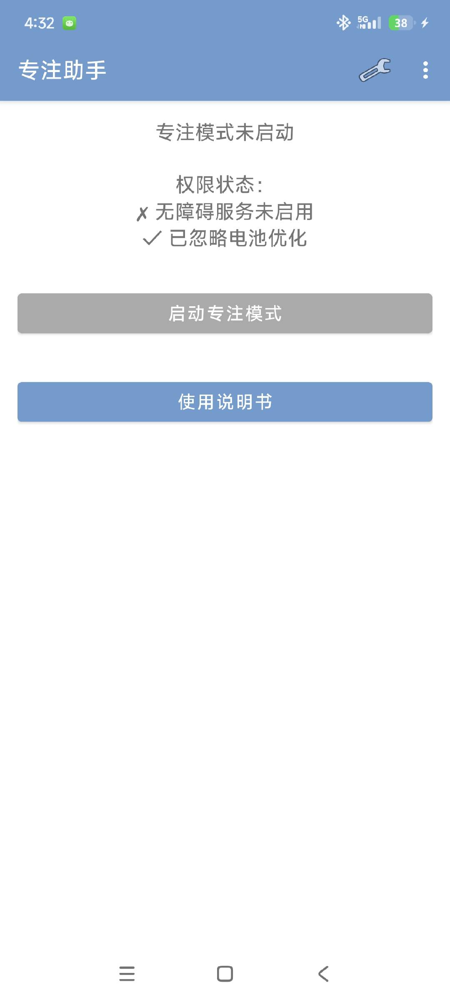
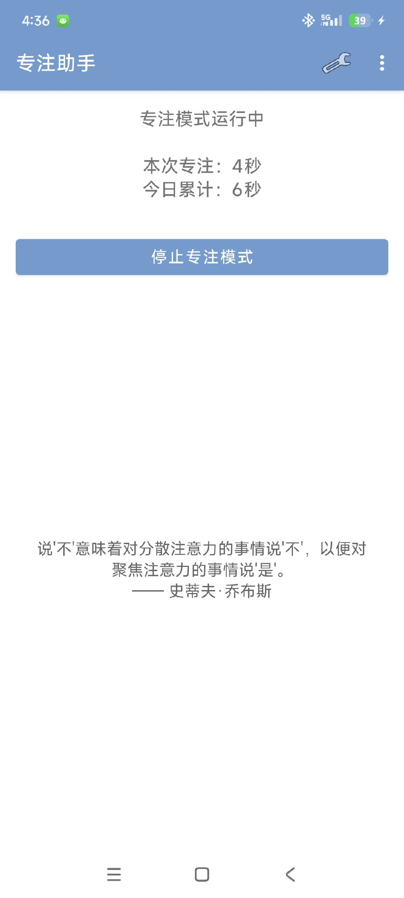
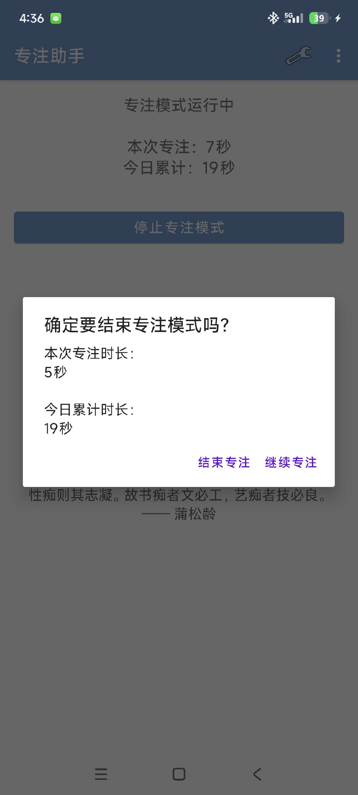
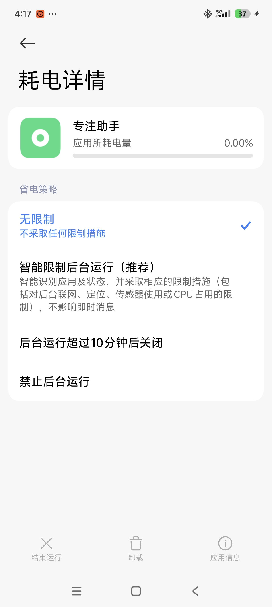
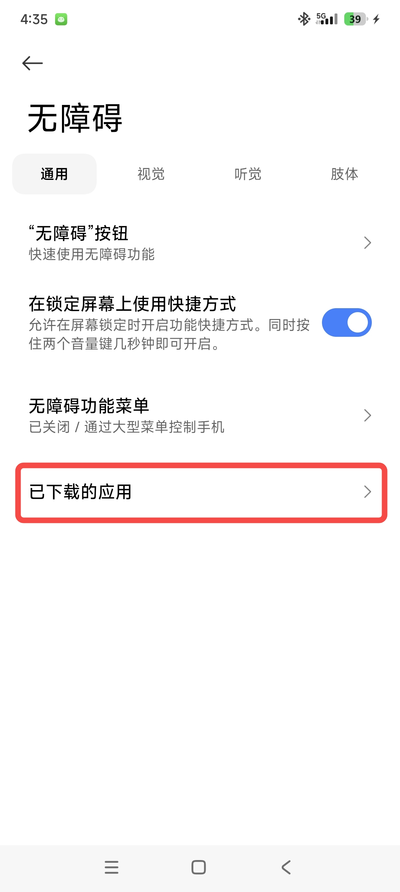
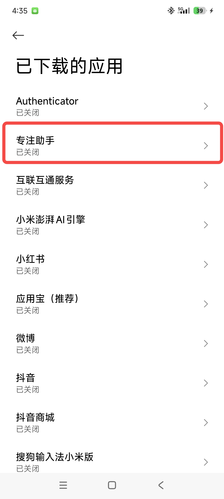
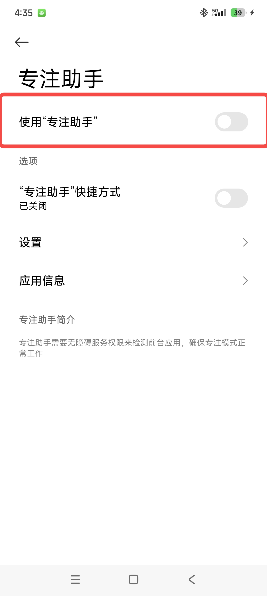
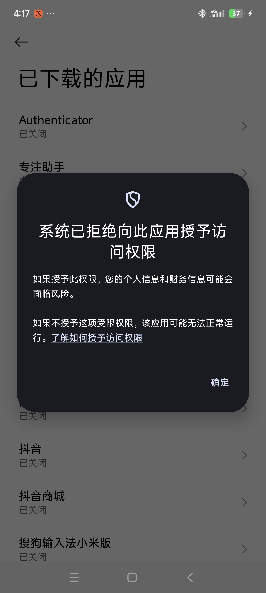
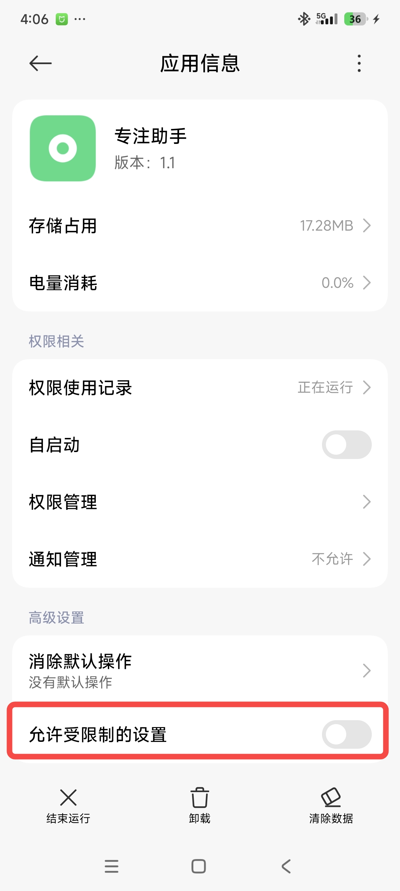

# 专注助手 应用说明文档

## 应用概述

专注助手是一款帮助用户提升专注力、减少手机依赖的自律应用。

本应用在于阻断习惯性刷手机的问题，而无法强制不使用手机中的某些应用， 也就是一个强制提醒。

手机重度上瘾者请选择使用更加强烈的彻底锁机App或者物理戒断。  

通过检测并阻止访问指定的应用（如微信、抖音、小红书等），帮助用户在工作、学习时保持专注，培养良好的数字生活习惯。

本应用需要电池免优化的权限，因为智能手机的一般应用会默认被休眠，本应用需要驻留后台。

本应用需要无障碍模式全权限来关闭应用，此权限一般为大多数自律应用所必须，因此可能会被某些手机弹窗警告隐私问题。下文解释了原因。

本应用程序源码公开，使用免费，担心安全问题可以自行阅读源码并且编译安装。

## 界面展示

  
  
  

## 主要功能

### 专注模式
- **一键启动**：点击"开始专注"按钮即可启动专注模式
- **应用屏蔽**：自动检测并阻止访问被屏蔽的应用列表
- **自动返回桌面**：当尝试打开被屏蔽的应用时，立即返回桌面并显示提示消息
- **进程清理**：尝试终止被屏蔽应用的进程（需要系统权限支持）

### 专注时长统计
- **实时显示**：专注模式运行时，实时显示本次专注时长和今日累计时长
- **数据持久化**：专注时长数据自动保存，支持跨应用重启
- **每日重置**：每日自动重置累计时长，开始新的统计周期
- **结束确认**：停止专注前显示确认对话框，展示本次专注时长和今日累计时长

### 主题个性化
- **12种主题颜色**：提供紫色、蓝色、绿色、红色、橙色、青色、天蓝色、靛蓝色、粉色、棕色、灰色、蓝灰色等多种低饱和度纯色主题
- **动态应用**：主题颜色会应用到按钮、标题栏和状态栏
- **智能显示**：专注模式运行时自动隐藏主题设置按钮，避免干扰

### 励志名言
- **随机展示**：在非专注模式下，在空白区域随机显示励志名言
- **精选内容**：包含来自罗曼·罗兰、歌德、乔布斯、诸葛亮等名人的专注相关名言

## 被屏蔽的应用列表

默认屏蔽以下应用：

目前是写死了，需要屏蔽其他应用，请联系开发者增加名单~！！！

- 微信 (com.tencent.mm)
- QQ (com.tencent.mobileqq)
- 微博 (com.sina.weibo)
- 知乎 (com.zhihu.android)
- 抖音 (com.ss.android.ugc.aweme)
- 腾讯新闻 (com.tencent.news)
- 网易新闻 (com.netease.newsreader.activity)
- 京东 (com.jingdong.app.mall)
- 淘宝 (com.taobao.taobao)
- 美团 (com.sankuai.meituan)
- 小红书 (com.xingin.xhs)

## 使用指南

### 首次使用
1. **授予无障碍权限**：应用启动时会引导您前往系统设置开启无障碍服务权限
2. **忽略电池优化**：建议在设置中忽略电池优化，确保应用在后台正常运行

### 基本操作
1. **启动专注模式**：点击"开始专注"按钮
2. **查看统计信息**：专注模式运行时，界面会显示本次专注时长和今日累计时长
3. **停止专注模式**：点击"停止专注"按钮，确认后结束本次专注
4. **设置主题颜色**：点击右上角的设置图标，选择喜欢的主题颜色
5. **查看权限设置**：点击右上角三个点菜单中的"设置"，检查和配置权限

### 注意事项
- 专注模式启动后，被屏蔽的应用将无法正常使用
- 建议在开始专注前关闭不必要的应用
- 如需修改被屏蔽的应用列表，需要修改代码中的 `BLOCKED_PACKAGES` 数组

## 权限设置

### 1. 电池优化设置

  

### 2. 无障碍服务设置

  
  
  

### 3. 无障碍服务被屏蔽提示

  
  

## 工作原理

### 简单说明

专注助手通过以下简单步骤实现应用屏蔽：

1. **启动监控**：点击"开始专注"后，应用开始监控您打开的应用
2. **检测应用**：当您打开任何应用时，应用会立即检测这是哪个应用（通过应用包名识别）
3. **判断是否屏蔽**：如果这个应用在被屏蔽列表中（如微信、抖音），立即执行屏蔽
4. **执行屏蔽**：显示提示消息，然后立即返回桌面，让您无法使用被屏蔽的应用

**核心原理**：应用使用 Android 系统的"无障碍服务"功能，可以知道您当前打开了哪个应用，然后自动帮您返回桌面。

> 📖 **想了解详细的技术实现原理？** 请查看 [技术原理详解](dev.md#技术原理详解)

### 为什么需要无障碍权限？

无障碍服务是 Android 系统提供的唯一方式，可以让普通应用（无需 root 权限）检测当前打开的应用。应用**只用于检测应用名称**，不会读取您的屏幕内容、不会记录您的操作、不会上传任何数据。

## 技术特性

- **无障碍服务**：使用 `AccessibilityService` 检测前台应用，无需 root 权限
- **前台服务**：使用前台服务保持应用运行，防止被系统杀死
- **自动返回桌面**：使用 `performGlobalAction(GLOBAL_ACTION_HOME)` 自动返回桌面
- **数据持久化**：使用 `SharedPreferences` 存储专注时长和设置数据
- **实时更新**：使用 `Handler` 实现每秒更新专注时长显示
- **动态主题**：支持运行时动态切换主题颜色，应用到多个 UI 组件

## 权限说明

| 权限 | 用途 | 必要性 |
|------|------|--------|
| 无障碍服务 | 检测前台应用、自动返回桌面 | 必需 |
| 忽略电池优化 | 防止应用被系统杀死 | 强烈建议 |
| 自启动权限 | 防止应用被系统清理（MIUI 特有） | 建议 |

## 安全与隐私说明

### 无障碍服务权限说明

**为什么需要无障碍权限？**

专注助手需要无障碍服务权限来实现应用屏蔽功能。这是 Android 系统提供的唯一方式，可以让普通应用（无需 root）检测当前前台运行的应用。

**我们如何使用无障碍权限？**

- ✅ **仅检测应用包名**：应用只读取当前前台应用的包名（如 `com.tencent.mm`），用于判断是否为被屏蔽的应用
- ✅ **监听窗口状态变化**：仅监听 `TYPE_WINDOW_STATE_CHANGED` 事件，不监听其他事件类型
- ✅ **执行返回桌面操作**：当检测到被屏蔽应用时，执行返回桌面操作
- ❌ **不读取屏幕内容**：应用不会读取屏幕上的文字、图片或其他内容
- ❌ **不记录用户操作**：应用不会记录您的点击、输入或其他操作
- ❌ **不上传数据**：应用完全离线运行，不会上传任何数据到服务器
- ❌ **不访问敏感信息**：应用不会访问您的联系人、短信、通话记录等敏感信息

**隐私保护承诺**

1. **本地处理**：所有数据仅在您的设备本地处理，不会上传到任何服务器
2. **最小权限原则**：应用仅请求实现功能所必需的最小权限
3. **代码开源**：应用代码完全开源，您可以自行审查代码，确认没有恶意行为
4. **随时可关闭**：您可以随时在系统设置中关闭无障碍服务权限，应用会立即停止监控

**如何关闭无障碍权限？**

如果您不再需要专注模式功能，可以随时关闭：
1. 打开系统设置 → 无障碍（或辅助功能）
2. 找到"专注助手"
3. 关闭开关即可

关闭后，应用将无法检测和屏蔽应用，但其他功能（如专注时长统计、主题设置）仍可正常使用。

**常见问题**

- **Q: 无障碍权限安全吗？**  
  A: 无障碍权限本身是安全的，关键在于应用如何使用。专注助手仅用于检测应用包名，不收集任何其他数据。代码完全开源，您可以自行审查。

- **Q: 应用会监控我的所有操作吗？**  
  A: 不会。应用只监听窗口状态变化事件，仅获取应用包名，不会监控您的具体操作。

- **Q: 数据会上传到服务器吗？**  
  A: 不会。应用完全离线运行，所有数据仅在本地存储，不会上传任何信息。

## 系统要求

- Android 5.0 (API 21) 及以上
- 特别优化支持小米 HyperOS

## 安装包位置

安装包位于：`app/release/app-release.apk`

## 开发文档

更多技术细节和开发文档请查看 `dev-docs/` 目录。
